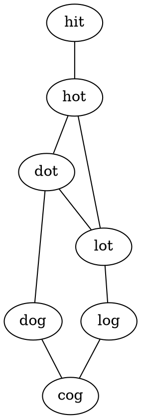

给定两个单词（beginWord 和 endWord）和一个字典，找到从 beginWord 到 endWord 的最短转换序列的长度。转换需遵循如下规则：

每次转换只能改变一个字母。
转换过程中的中间单词必须是字典中的单词。
说明:

如果不存在这样的转换序列，返回 0。
所有单词具有相同的长度。
所有单词只由小写字母组成。
字典中不存在重复的单词。
你可以假设 beginWord 和 endWord 是非空的，且二者不相同。

```case
示例 1:

输入:
beginWord = "hit",
endWord = "cog",
wordList = ["hot","dot","dog","lot","log","cog"]

输出: 5

解释: 一个最短转换序列是 "hit" -> "hot" -> "dot" -> "dog" -> "cog",
     返回它的长度 5。
示例 2:

输入:
beginWord = "hit"
endWord = "cog"
wordList = ["hot","dot","dog","lot","log"]

输出: 0

解释: endWord "cog" 不在字典中，所以无法进行转换。
```

---

此题为最短路径问题

使用bfs



初始化一张图，用map存储所有路径 从起始位置出发，宽度优先搜索，并记录到达的点，深度加一 寻找到最后一个位置，返回深度

```go
func LadderLength(beginWord string, endWord string, wordList []string) int {
    begin := -1
    end := -1

    for i, item := range wordList {
        if item == beginWord {
            begin = i
        } else if item == endWord {
            end = i
        }
    }
    if begin == -1 {
        wordList = append([]string{beginWord}, wordList...)
    }
    if -1 == end {
        //wordList = append(wordList, endWord)
        return 0
    }

    for i, item := range wordList {
        if item == beginWord {
            begin = i
        } else if item == endWord {
            end = i
        }
    }

    // 初始化无向图
    routes := make(map[int][]int)
    for i := 0; i < len(wordList)-1; i++ {
        for j := i + 1; j < len(wordList); j++ {
            s1 := wordList[i]
            s2 := wordList[j]
            connected := false
            for i := 0; i < len(s1); i++ {
                if s1[i] != s2[i] {
                    if connected == false {
                        connected = true
                    } else {
                        connected = false
                        break
                    }
                }
            }
            if connected {
                routes[i] = append(routes[i], j)
                routes[j] = append(routes[j], i)
            }
        }
    }

    count := 0
    store := make([]int, len(wordList))
    queue := make([]int, 0)
    for _, j := range routes[begin] {
        if store[j] != 1 {
            queue = append(queue, j)
            store[j] = 1
        }
    }
    for len(queue) > 0 {
        count++
        next := make([]int, 0)
        for _, start := range queue {
            for _, item := range routes[start] {
                if item == end {
                    return count + 1
                }
                if store[item] != 1 {
                    next = append(next, item)
                    store[item] = 1
                }
            }
        }
        queue = next
    }
    return 0
}
```
