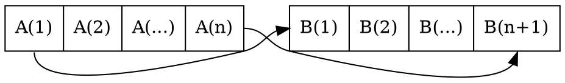
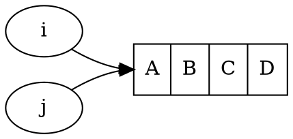
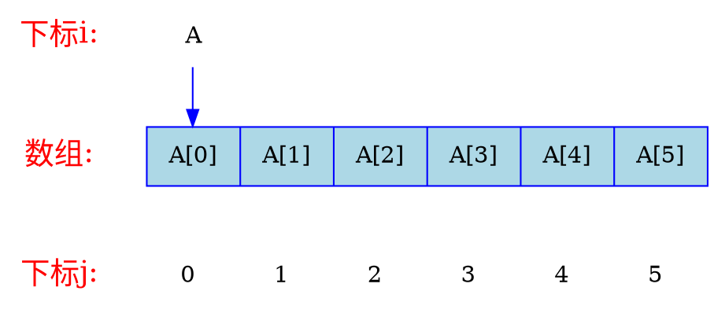

```graphviz
digraph G
{
    rankdir=LR;
    Array1 [ shape = record, label = "{ <a1>A(1) | <a2>A(2) | <a3>A(...) | <an>A(n)}"] ;
    Array2 [ shape = record, label = "{ <b1>B(1) | <b2>B(2) | <b3>B(...) | <bn1>B(n+1)}"] ;
    Array1:a1 -> Array2:b1 [style=solid];
    Array1:an -> Array2:bn1 [style=solid];
    //{rank=same; Array1; Array2;}
}
```

数组

```graphviz
digraph so
{
  rankdir = LR;

  subgraph{
    Array [ shape = record, label = "{ <f0> A | B | C | D }"] ;
  }


  i -> Array: f0
  j -> Array: f0
}
```

```graphviz
digraph {
    node [shape=plaintext, fontcolor=red, fontsize=18];
    "下标i:" -> "数组:" -> "下标j:" [color=white];

    node [shape=record, fontcolor=black, fontsize=14, width=4.75, fixedsize=true];
    pointers [label="<f0> A | <f1>  | <f2>  | <f3> | <f4>  | <f5> ", color=white];
    Array [label="<f0> A[0] | <f1> A[1] | <f2> A[2] | <f3> A[3] | <f4> A[4] | <f5> A[5]", color=blue, fillcolor=lightblue, style=filled];
    indices [label="0 | 1 | 2 | 3| 4 | 5", color=white];

    { rank=same; "下标i:"; pointers }
    { rank=same; "数组:"; Array }
    { rank=same; "下标j:"; indices }

    edge [color=blue];

    pointers:f0 -> Array:f0;
}
```
