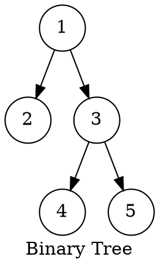
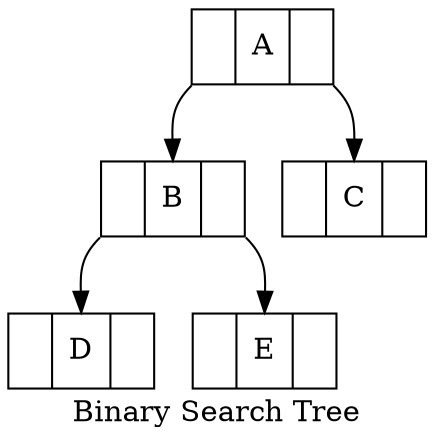

---

二叉树

```graphviz
digraph BinaryTree{
   label = "Binary Tree"
   node[shape = circle]
   1 -> 2
   1 -> 3
   3 -> 4
   3 -> 5
}
```

二叉搜索树

```graphviz
digraph BinarySearchTree{
   label = "Binary Search Tree"
   node[shape = record]
   A[label = "<f0> | <f1> A | <f2>"]
   B[label = "<f0> | <f1> B | <f2>"]
   C[label = "<f0> | <f1> C | <f2>"]
   D[label = "<f0> | <f1> D | <f2>"]
   E[label = "<f0> | <f1> E | <f2>"]
   A: f0: sw -> B: f1: n
   A: f2: se -> C: f1
   B: f0: sw -> D: f1
   B: f2: se -> E: f1
}
```
