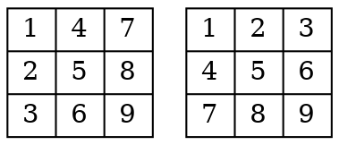
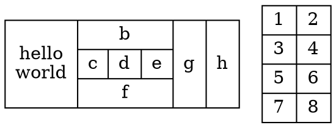

表格

```graphviz
digraph G{
  node[shape = record]
  table1[label = "
    {1|2|3} |
    {4|5|6} |
    {7|8|9}
   "]
  table2[label = "{
    {1|2|3} |
    {4|5|6} |
    {7|8|9}
   }"]
}
```

表格

- 一个大括号里的是一行 {}
- 竖线分割的是不同列 |

```graphviz
digraph G{
   node[shape = record]
   table1[label="hello\nworld | { b |{c|<here> d|e}|f}| g | h"];
   
   table2[label="{{1|2}|{3|4}|{5|6}|{7|8}}"]
}
```
